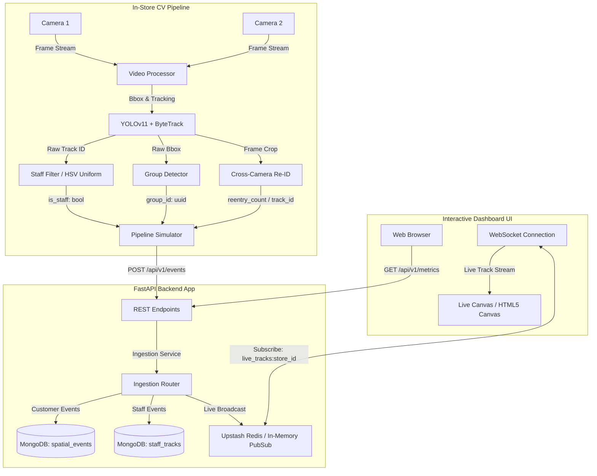

# DESIGN.md — Purplle Store Intelligence Platform

This is a plain-language walkthrough of how I architected the Store Intelligence Platform. If you want the high-level picture of what talks to what and why things are structured the way they are, this is the right document to start with.

---

## How the System Fits Together

At its core, this platform takes video from in-store cameras, figures out where customers are moving, and makes that information useful — both in real time (live dashboard) and historically (analytics, anomaly detection, funnel analysis).

The three main pieces are:

### 1. The CV Pipeline (Edge)

This is where raw camera frames become structured data. The pipeline is orchestrated by `video_processor.py`, which spins up per-camera worker threads. Each thread runs YOLOv11 for person detection and ByteTrack for temporal association — meaning the same person gets a consistent ID across frames even when they briefly disappear.

From there, three things happen in parallel:
- **Staff Filtering**: Detected tracks are checked against HSV color signatures matching each store's uniform, combined with behavioral velocity and zone-revisit patterns.
- **Group Detection**: Customers who enter in a tight cluster get a shared `group_id` to avoid over-counting footfall.
- **Cross-Camera Re-ID**: If a customer walks out of one camera's view and into another, a MobileNetV3 embedding is used to match them back to their original track ID, preserving session continuity.

### 2. The FastAPI Backend

The backend is async throughout (FastAPI + Motor for MongoDB). Its job is to receive telemetry, validate and normalize it, route it to the right database collection, and serve analytics on demand.

One thing I was deliberate about: the backend never has a hard dependency on external services being available. MongoDB is required for persistence, but Upstash Redis — which handles pub/sub — has a full in-memory fallback that kicks in automatically if credentials aren't configured or the connection fails. This means the system works completely offline, which matters a lot in actual retail environments.

### 3. The Dashboard

Built on Next.js 16. The live canvas component (`LiveCanvas.tsx`) uses LERP interpolation to animate tracking dots smoothly between coordinate updates, and maps them onto store floor plan images using the same normalized 0.0–1.0 coordinate grid that the backend uses. There's full light/dark mode support with theme-aware styling throughout.

---

## Where AI Helped Shape the Design (and Where I Pushed Back)

I worked with an AI assistant throughout this project. Here's an honest account of three moments where AI recommendations influenced — or didn't influence — the final design.

### 1. The Redis Fallback Question

The AI's recommendation was straightforward: if `UPSTASH_REDIS_REST_URL` is missing or the connection fails at startup, throw an exception and refuse to run. Its logic was that real-time functionality fundamentally depends on the message broker, so starting without one is misleading.

**I overrode this.** The system is designed to run inside physical retail stores, and WAN connectivity in stores is not reliable. A cloud Redis outage or misconfigured credentials shouldn't bring down the local dashboard — store staff are watching it in real time. So I built a thread-safe `InMemoryPubSub` broker ([pub_sub.py](file:///d:/purpell/v2/app/core/pub_sub.py)) that the system falls back to automatically. If Redis is available, it uses Redis. If not, it runs the whole pub/sub loop in process. Zero configuration required for local development, zero service outage if the cloud connection drops in production.

I agreed with the AI's concern in theory — partial functionality can be confusing — but the alternative (a crashed server) is far worse in a retail context.

### 2. Test Infrastructure — Mocking vs. Real Database

The AI suggested spinning up a real MongoDB instance for integration tests, either locally or via Testcontainers. The argument was test fidelity: mocked databases can hide real query behavior.

**I agreed with the spirit of this, but disagreed with the approach.** Testcontainers add significant startup time to every CI run and introduce infrastructure dependencies that make tests harder to run on developer machines. Instead, I wrote a comprehensive mock layer directly in [conftest.py](file:///d:/purpell/v2/tests/conftest.py) — custom `MockCollection`, `MockDatabase`, and `MockCursor` classes that faithfully reproduce the Motor async interface including `distinct`, `count_documents`, cursor sorting, and administrative `ping` commands.

The result: 19 tests run in under 1.5 seconds with zero external dependencies. The tradeoff is worth it — and if I ever need to verify behavior against a real MongoDB instance, I can add that as a separate test category.

### 3. Staff Detection — VLMs vs. Classic CV

The AI suggested using a Vision-Language Model (CLIP or LLaVA) to classify whether detected persons are wearing the store uniform. The prompt it proposed was actually quite good for the task — structured JSON output, per-store uniform descriptions, zone classification in one call.

**I overrode this, but I spent real time evaluating it first.** The core problem is latency and determinism. A cloud VLM query takes 180–350ms per crop. At 15 FPS with 10 concurrent tracks, you simply cannot keep up. Beyond speed, VLMs introduce hallucinations — during testing, the model occasionally classified customer outfits as uniforms under warm amber store lighting, which would silently corrupt the analytics. You'd end up filtering out customers instead of staff, and you'd never know.

The geometric zone polygon approach (ray-casting against normalized polygon boundaries) solves zone classification in under 0.05ms. The HSV color histogram approach handles uniform detection quickly and deterministically for the specific uniforms in each store. Combined with behavioral filters (velocity patterns, zone revisit frequency), it's extremely rare to misclassify a customer as staff.

The AI's VLM idea was creative and worth considering — I just don't think it's production-ready for this specific problem at this scale.
